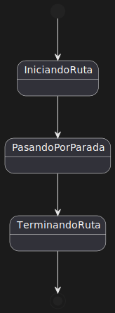
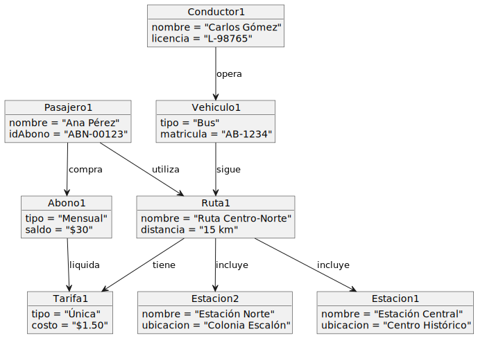

# Sistema de Transporte Público RESPUESTAS EXAMEN

## Diagrama de Clases

### Diagrama de Clases Compacto
Este diagrama muestra la estructura de las clases principales del sistema, incluyendo relaciones y herencias entre las entidades.

---

## Diagrama de Objetos

### Diagrama de Objetos para un Viaje
Este diagrama representa una instancia específica de un viaje en el sistema de transporte, mostrando cómo interactúan los objetos individuales (como `Ruta`, `Vehiculo`, `Conductor`, `Pasajero`, `Abono`, `Tarifa` y `Estacion`) en un contexto de viaje.

---

## Diagramas de Estados

### 1. Diagrama de Estados para el Pasajero
Representa el ciclo de vida de un pasajero durante un viaje, desde la espera del transporte hasta la finalización del viaje.

### 2. Diagrama de Estados para la Ruta
Describe los estados de una ruta desde que se planifica hasta su finalización.

---

# Sistema de Transporte Público POST EXAMEN

## Diagrama de Clases

### Diagrama de Clases Compacto
Este diagrama muestra la estructura de las clases principales del sistema, incluyendo relaciones y herencias entre las entidades.

---

## Diagrama de Objetos

### Diagrama de Objetos para un Viaje
Este diagrama representa una instancia específica de un viaje en el sistema de transporte, mostrando cómo interactúan los objetos individuales (como `Ruta`, `Vehiculo`, `Conductor`, `Pasajero`, `Abono`, `Tarifa` y `Estacion`) en un contexto de viaje.

---

## Diagramas de Estados

### 1. Diagrama de Estados para el Pasajero
Representa el ciclo de vida de un pasajero durante un viaje, desde la espera del transporte hasta la finalización del viaje.

### 2. Diagrama de Estados para la Ruta
Describe los estados de una ruta desde que se planifica hasta su finalización.

### 3. Diagrama de Estados para el Abono
Representa los estados de un abono en función de su vigencia, uso y recarga.

### 4. Diagrama de Estados para las Incidencias
Un diagrama sencillo que muestra los estados de una incidencia, en función de si está activa o inactiva.

---
